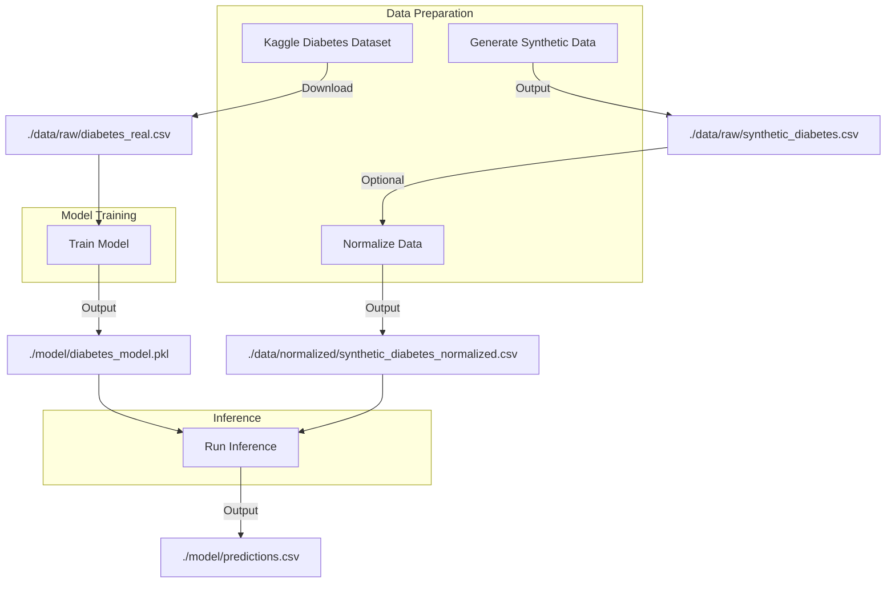

# **Pipeline Documentation**  
**Last Updated:** [Date]  
**Author:** [Your Name]  

---

## **1. Overview**  
This pipeline describes the workflow for:  
1. **Training a logistic regression model** on a real diabetes dataset (from Kaggle).  
2. **Generating synthetic data** to test the model.  
3. **Normalizing data** (optional, depending on logistic regression settings).  
4. **Running inference** on synthetic data using the trained model.  

---

## **2. Pipeline Steps**  

### **Step 1: Obtain Real Dataset (Kaggle)**
- **Source:** Download a diabetes dataset (e.g., [Pima Indians Diabetes Dataset](https://www.kaggle.com/datasets/uciml/pima-indians-diabetes-database)).  
- **Storage:** Place it in `./data/raw/`.  
- **File Naming:**  
  - Example: `./data/raw/diabetes_real.csv`  

### **Step 2: Train the Model**
- **Script:** `./model/train_model.py`  
- **Input:** `./data/raw/diabetes_real.csv`  
- **Output:**  
  - Trained model (saved as `./model/diabetes_model.pkl`).  
  - Optionally, normalized training data (if used).  

#### **Example Command:**
```sh
python ./model/train_model.py 
```

---

### **Step 3: Generate Synthetic Data**
- **Script:** `./data/scripts/synthetic_data_ds.py`  
- **Output:**  
  - Raw synthetic data (`./data/raw/synthetic_diabetes.csv`).  
  - (Optional) Normalized synthetic data (`./data/normalized/synthetic_diabetes_normalized.csv`).  

#### **Example Command:**
```sh
python ./data/scripts/synthetic_data_ds.py
```

#### **Optional: Normalize Synthetic Data**
- **Script:** `./data/scripts/normalize_data.py`  
- **Input:** `./data/raw/synthetic_diabetes.csv`  
- **Output:** `./data/normalized/synthetic_diabetes_normalized.csv`  

```bash
python ./data/scripts/normalize_data.py
```

---

### **Step 4: Run Inference on Synthetic Data**
- **Script:** `./model/ciphertext_model.py`  
- **Input:**  
  - Trained model (`./model/diabetes_model.pkl`).  
  - Synthetic data (`./data/raw/synthetic_diabetes.csv` or `./data/normalized/synthetic_diabetes_normalized.csv`).  
- **Output:** Predictions (e.g., `./model/predictions.csv`).  

#### **Example Command:**
```bash
python ./model/ciphertext_model.py 
```

---

## **3. Pipeline Diagram**  


---

## **4. Key Considerations**  
✅ **Normalization:** Only needed if:  
   - Using **L1/L2 regularization**.  
   - Features have **vastly different scales** (e.g., `Glucose` vs. `BMI`).  

✅ **Synthetic Data Generation:**  
   - Ensure distributions mimic real data.  
   - Useful for **testing model robustness**.  

✅ **Encrypted Model (`ciphertext_model.py`):**  
   - If using **homomorphic encryption**, ensure data is preprocessed correctly.  

---

## **5. Future Improvements**  
- **Automate pipeline** with `Makefile` or `Snakemake`.  
- **Add validation checks** for synthetic data quality.  
- **Deploy model as an API** (e.g., Flask/FastAPI).  

---

## **6. How to Run Full Pipeline**  
```bash
# 1. Train model
python ./model/train_model.py

# 2. Generate synthetic data
python ./data/scripts/synthetic_data_ds.py

# 3. (Optional) Normalize synthetic data
python ./data/scripts/normalize_data.py 

# 4. Run predictions
python ./model/ciphertext_model.py 
```

---
